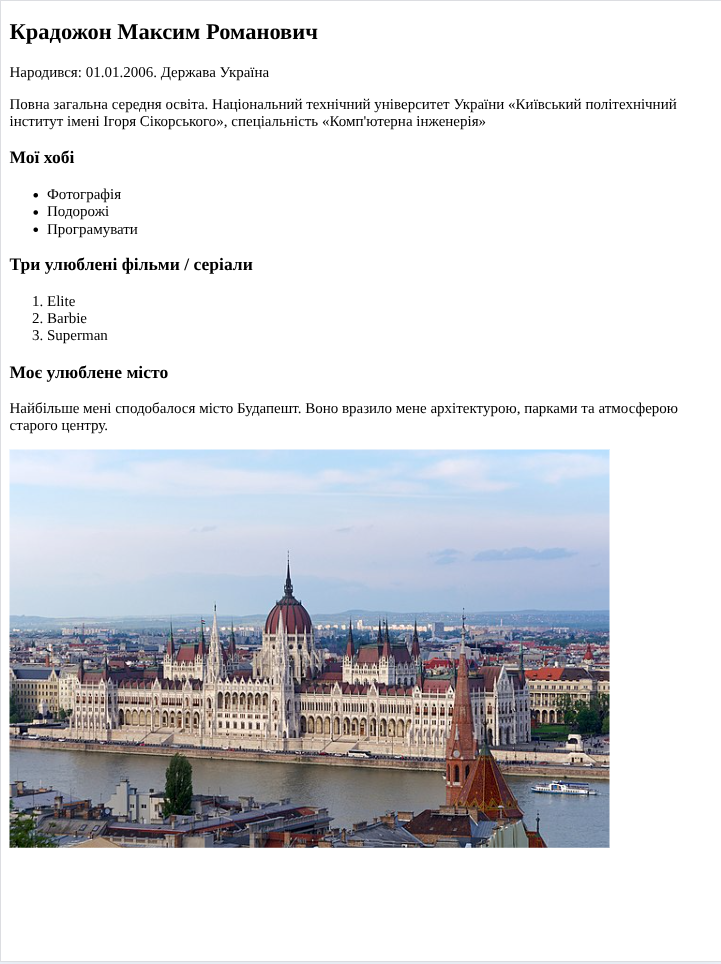
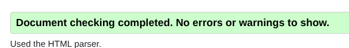

# Лабораторна робота №1

## Відомості

### Тема

Мова гіпертекстової розмітки сайту HTML-5

### Мета

Ознайомлення з базовою структурою HTML5-документа, використання основних тегів (title, meta, заголовки, абзаци, списки, посилання, зображення).
Навчитися створювати просту персональну веб-сторінку та перевіряти її валідність за допомогою HTML-валідаторів.

### Використані інструменти

- Visual Studio Code — як редактор коду.

> Використані розширення: Prettier (для форматування та виявленню помилок), ESLint (для валідації коду).
> Module bundler: Vite (для запуску локального серверу)

- HTML5 — основна мова розмітки.

- Валідатор HTML [(W3C)](https://validator.w3.org/nu/#file) — для перевірки правильності коду.

## Хід виконання роботи

1. Створив новий проєкт `lab1` у VS Code.
2. Додав базову структуру HTML5-документа з тегами `<head>` і `<body>`
3. У `<head>` прописав:

- `<title>` — прізвище, ініціали, групу.
- `<meta charset="UTF-8">` — кодування.
- `<meta name="keywords">` і `<meta name="description">`

4. У `<body>` розмістив інформацію:

- 3 абзаци про автора.
- Список хобі (ненумерований).
- Список улюблених фільмів (нумерований).
- Опис улюбленого міста.
- Фото міста, обгорнуте у посилання на сайт міста

5. Виконав перевірку через W3C Validator — помилки відсутні.

## Результати

## Висновки

У ході роботи створено персональну HTML5-сторінку. Ознайомився з основними тегами для метаінформації, текстових блоків, списків, зображень та посилань.
Навчився користуватися HTML-валідаторами та інструментами для підтримки якості коду (Prettier, ESLint).

## Посилання

[GitHub](https://github.com/TockePie/front-end-uni)
