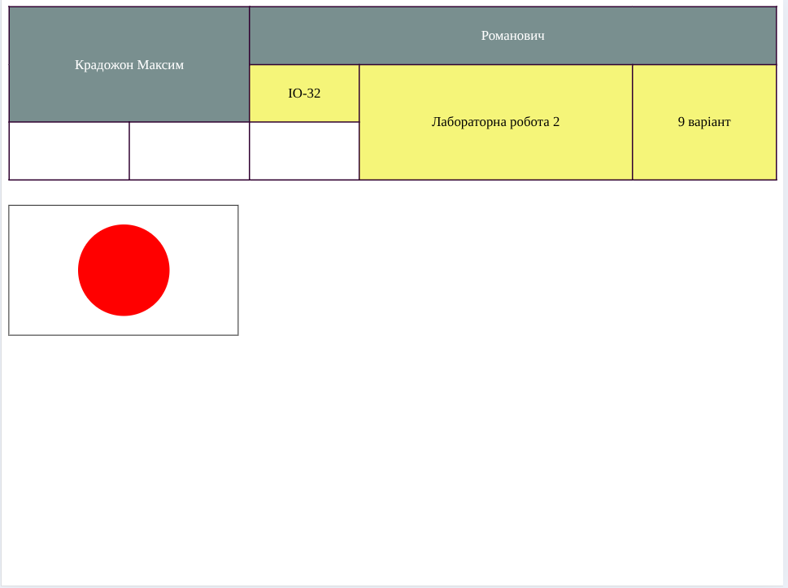

# Лабораторна робота №2

## Відомості

### Тема

Таблиці в HTML-5. Створення зображень засобами трансформацій в CSS-4

### Мета

- Опрацювати та закріпити навички створення таблиць у HTML5 (структурування рядків і комірок, використання атрибутів colspan/rowspan, доступність).
- Навчитися застосовувати CSS для стилізації таблиць (кольори, межі, вирівнювання).
- Навчитися створювати прості графічні композиції за допомогою CSS (position або transform) без зображень.
- Навчитися підключати зовнішній CSS-файл та використовувати псевдо-класи (hover) для взаємодії.

### Використані інструменти

- Visual Studio Code — як редактор коду.

> Використані розширення: Prettier (для форматування та виявленню помилок), ESLint (для валідації коду).
> Module bundler: Vite (для запуску локального серверу)

- HTML5 — основна мова розмітки.
- CSS4 - мова каскадних таблиць

## Хід виконання роботи

1. Створено проєктні файли index.html і style.css; підключено CSS відносним шляхом.
2. Змоделював таблицю: перший рядок — 2 td (прізвище, ім'я, по батькові), другий — 3 td (група, № лаб. роботи, варіант).
3. Оформив стилі: розміри, межі, background-color для рядків з підстановкою nn, контрастний колір тексту (обрано через color.adobe.com), :hover — переставлення кольорів.
4. Створив CSS-зображення: варіант position — елементи з position:absolute.

## Результати

- index.html з правильною таблицею (ПІБ у двох комірках; група, № лаб., варіант у трьох комірках).
- style.css із стилями для таблиці, hover-ефектом та секцією для CSS-зображення.

## Посилання

[GitHub](https://github.com/TockePie/front-end-uni/lab2)
