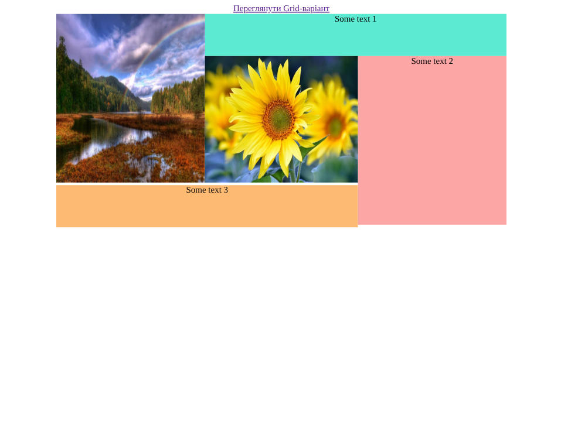
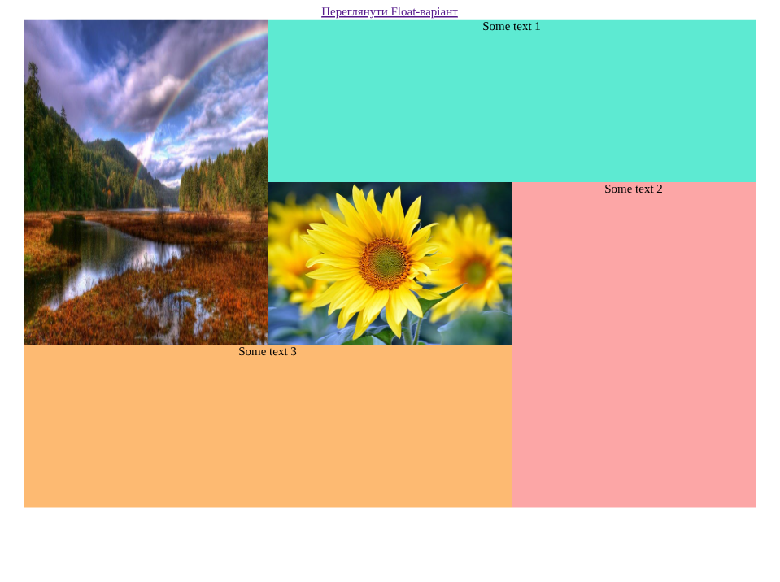

# Лабораторна робота №3

## Відомості

### Тема

Блочна верстка макету сайту за допомогою HTML і CSS

### Мета

- Ознайомитися з принципами блочної верстки веб-сторінок за допомогою HTML5 та CSS4.
- Закріпити навички використання технологій float та flexbox для побудови адаптивної структури сайту.
- Навчитися застосовувати відносні одиниці вимірювання (відсотки) для забезпечення гнучкості макету.
- Сформувати практичні навички роботи з інструментами верстки та організації проєкту на GitHub

### Використані інструменти

- Visual Studio Code — як редактор коду.

> Використані розширення: Prettier (для форматування та виявленню помилок), ESLint (для валідації коду).
> Module bundler: Vite (для запуску локального серверу)

- HTML5 — основна мова розмітки.
- CSS4 - мова каскадних таблиць

## Хід виконання роботи

1. Ознайомився з макетом сайту, розробленим у Photoshop, та визначив основні структурні блоки (шапка, меню навігації, контентна частина, сайдбар, футер).
2. Створив HTML-документ з базовою розміткою сторінки, використавши семантичні теги HTML5 (`<header>`, `<aside>`, `<footer>`).
3. Для Завдання 1:
   - Реалізував блочну верстку з використанням властивостей CSS float.
   - Задав ширину елементів у відсотках, щоб макет залишався відносно адаптивним.
4. Для Завдання 2:
   - Використав сучасну технологію Flexbox для верстки того ж макету.
   - Організував контейнер як flex-блок та налаштував вирівнювання і розташування елементів за допомогою властивостей display: flex;, justify-content, align-items.
   - Перевірив коректність відображення верстки у браузері та адаптивність при зміні розмірів вікна.
5. Створив репозиторій на GitHub та завантажив у нього проєкт.
6. Опублікував сайт за допомогою Vercel та отримав посилання для перегляду.

## Результати

### Float

### Grid

## Посилання

[GitHub](https://github.com/TockePie/front-end-uni/lab3)
