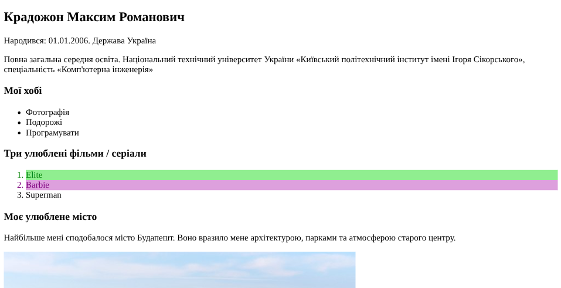
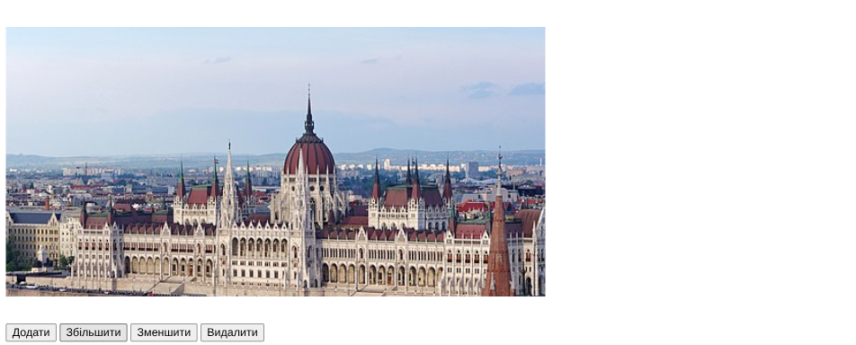

# Лабораторна робота №4

## Відомості

### Тема

Доступ до об'єктів і сценаріям. Доступ до властивостей і методів об'єктів

### Мета

Навчитися використовувати різні способи доступу до властивостей і методів об'єктів для внесення змін в HTML-документ.

### Використані інструменти

- Visual Studio Code — як редактор коду.

> Використані розширення: Prettier (для форматування та виявленню помилок), ESLint (для валідації коду).
> Module bundler: Vite (для запуску локального серверу)

- HTML5 — основна мова розмітки.
- CSS4 - мова каскадних таблиць

## Хід виконання роботи

1. **Створено файли:**
   `index.html`, `style.css`, `script.js`.

2. **Підключено файли** у `<head>`:

   ```html
   <link rel="stylesheet" href="style.css" />
   <script src="script.js" defer></script>
   ```

3. **Завдання 1:**

   - Визначено елементи за допомогою
     `getElementById()` та `querySelector()`.
   - Додано події `click`, які змінюють колір фону і тексту.
   - Оформлено стилі у CSS-класах `.f-element`, `.s-element`.

4. **Завдання 2:**

   - Під зображенням створено 4 кнопки: **Додати**, **Збільшити**, **Зменшити**, **Видалити**.
   - У `script.js` реалізовано функції для:

     - створення нового зображення;
     - зміни його розмірів;
     - видалення зображення.

## Результати

### Завдання 1



### Завдання 2



## Посилання

[GitHub](https://github.com/TockePie/front-end-uni/lab4)
