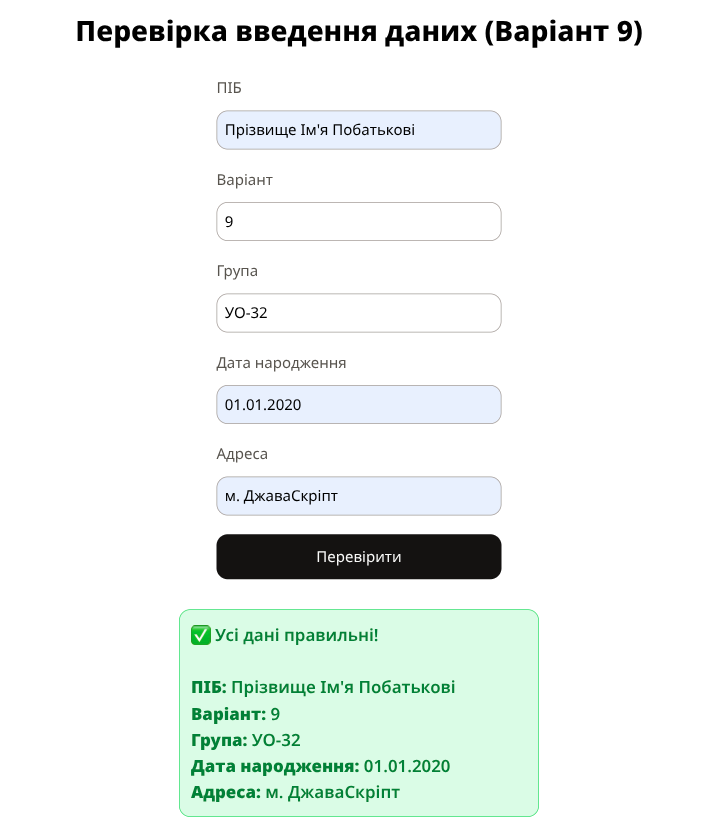
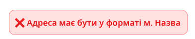
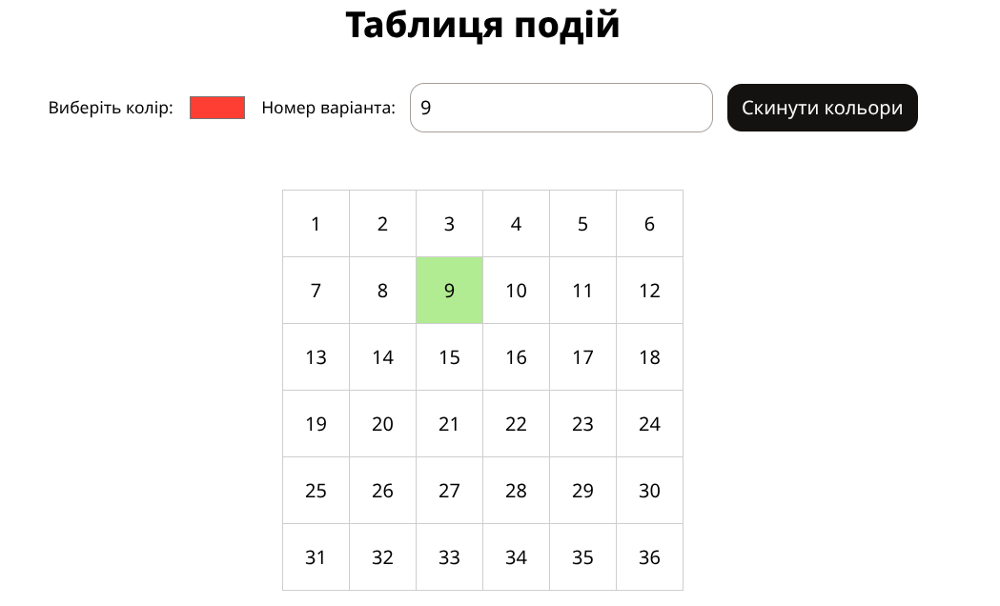
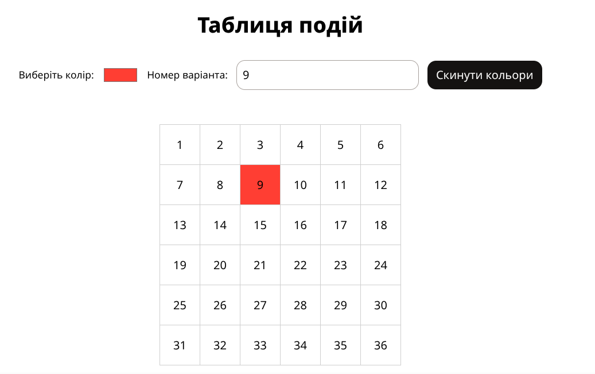

# Лабораторна робота №5

## Відомості

### Тема

Події. Регулярні вирази

### Мета

Навчитися використовувати наявні в моделі документа події для внесення змін в сторінку.

## Хід виконання роботи

### Завдання 1: Перевірка даних форми

1. Створено HTML-форму з полями: ПІБ, Варіант, Група, Дата народження, Адреса.
2. Усі поля перевіряються через **регулярні вирази**:

   - ПІБ: `^[А-ЯІЇЄҐ][а-яіїєґ']+\s[А-ЯІЇЄҐ][а-яіїєґ']+\s[А-ЯІЇЄҐ][а-яіїєґ']+$`
   - Група: `/^([А-Я]{2,6}\d{2}|[А-Я]{2}-\d{2}|[А-Я]\.[А-Я]\.)$/i`
   - Дата народження: `/^\d{2}\.\d{2}\.\d{4}$/`
   - Адреса: `/^м\.\s?[А-ЯІЇЄҐа-яіїєґ]{2,}$/`
   - Варіант повинен дорівнювати 9.

3. Логіка винесена в **клас `Helpers`**, який реалізує:

   - Перевірку полів (`checkField`)
   - Показ помилок (`showErrors`)
   - Показ успішного введення (`showSuccess`)
   - Візуальне виділення помилок (червоний бордер)

Результат: при коректному введенні даних користувач бачить блок із підтвердженням та введеними даними, при помилках - підсвічуються поля з помилкою та виводиться текст повідомлень.

---

### Завдання 2: Інтерактивна таблиця 6×6

1. Таблиця заповнена числами від 1 до 36 по рядках.
2. Реалізовані події для клітинки, яка відповідає номеру варіанта (9):

   - **mouseover**: зміна кольору на випадковий (`_randomColor()`)
   - **click**: зміна кольору на обраний з палітри
   - **dblclick**: фарбування клітинок стовпця, починаючи з обраної, через одну (варіант 9)

3. Логіка реалізована у спрощеному класі **`Grid6x6`**, який:

   - Створює таблицю та додає обробники подій
   - Фарбує клітинки відповідно до події
   - Має кнопку скидання кольорів

Результат: користувач може інтерактивно змінювати кольори клітинок відповідно до завдання.

## Результати

### Завдання 1

### Завдання 2

## Посилання

[GitHub](https://github.com/TockePie/front-end-uni/lab5)
